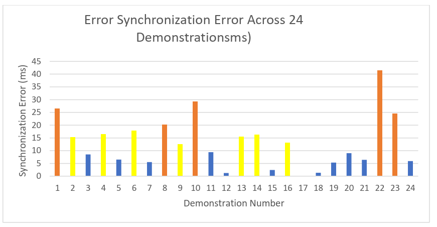
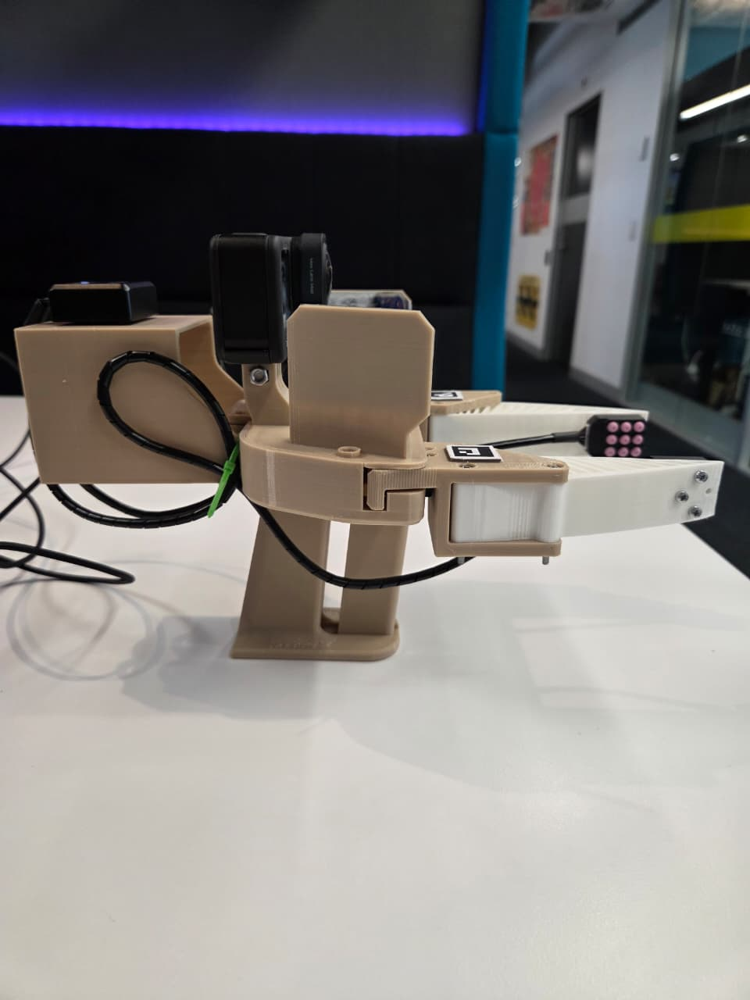

# UMI + Tactile Sensing for Robotic Imitation Learning

Extending the Universal Manipulation Interface (UMI) with PapillArray tactile
sensors to enable synchronized visual-tactile data collection for contact-rich
imitation learning.

> Master's Project · Queensland University of Technology, 2025
> Author: Omar Mohamed · Supervised by Prof. Niko Suenderhauf

---

## 📽️ Demo


---

## Problem & approach

Vision-only imitation learning systems cannot capture force, slip, or texture
information essential for delicate manipulation tasks. This project integrates
two PapillArray tactile sensors into the portable UMI gripper, adding touch
as a second modality alongside the GoPro Hero 9 (60 FPS, 155° fisheye lens).

**The core challenge:** visual data (60 FPS) and tactile data (up to 1000 Hz)
run on independent system clocks — unsynchronised data produces incorrect
state representations and degrades policy learning.

**Solution — three interconnected contributions:**

1. **Hardware integration** — custom 3D-printed mounting brackets (PLA+ body,
   TPU fingers) attach two PapillArray sensors to the UMI gripper fingertips,
   preserving portability and keeping sensors visible in the camera's field of view

2. **QR code-based synchronisation** — ROS2 timestamps are encoded into QR codes
   displayed at the start and end of each demonstration and filmed by the GoPro,
   establishing temporal anchor points without any specialised hardware

3. **ROS2 data pipeline** — a C++ node acquires raw tactile data at 1000 Hz;
   a Python node republishes at 60 Hz; a post-processing script interpolates
   tactile measurements to each video frame and appends them to the UMI Zarr
   dataset alongside camera observations and gripper trajectories

---

## Results

Evaluated across 24 demonstrations of a multi-phase manipulation task:
cup reorientation, grasping, and placement on a plate.

### Synchronisation accuracy

| Metric                        | Value      |
|-------------------------------|------------|
| Mean error                    | 12.43 ms   |
| Median error                  | 9.15 ms    |
| Standard deviation            | 10.23 ms   |
| Minimum error                 | 0.03 ms    |
| Maximum error                 | 41.5 ms    |
| 90th percentile               | 26.0 ms    |
| Demonstrations < 10 ms        | 13/24 (54.2%) |
| Demonstrations < 20 ms        | 19/24 (79.2%) |
| Demonstrations < 100 ms       | 24/24 (100%)  |
| QR detection success rate     | 85.7% (24/28) |

> Frame duration at 60 FPS = 16.67 ms.
> Mean error of 12.43 ms represents sub-frame synchronisation accuracy.
> All 24 demonstrations achieved the <100 ms success criterion.



### Key findings

- 54.2% of demonstrations achieved sub-10 ms accuracy — near-perfect
  temporal alignment under optimal QR capture conditions
- Highest errors (Demo_1: 26.4 ms, Demo_10: 29.3 ms, Demo_22: 41.5 ms)
  correlated with motion blur or non-perpendicular QR capture angles
- Sub-20 ms accuracy exceeds requirements for human-like manipulation
  learning (human tactile reaction time ≈ 150–200 ms)

---

## Hardware

| Component              | Specification                              |
|------------------------|--------------------------------------------|
| Tactile sensors        | 2× PapillArray (Contactile), 3×3 pillar array, up to 1000 Hz |
| Tactile data fields    | 3D forces, 3D displacements, slip detection, contact state, global torque, friction estimate |
| Camera                 | GoPro Hero 9, 60 FPS, 155° fisheye lens    |
| Gripper                | Modified UMI gripper (PLA+ body, TPU fingers) |
| Gripper redesign tool  | SolidWorks                                 |
| Data format            | Zarr (UMI SLAM pipeline compatible)        |


## Software
 
| Component              | Specification                                                                 |
|------------------------|-------------------------------------------------------------------------------|
| Operating system       | Ubuntu 22.04 LTS                                                              |
| Middleware             | ROS2 Humble                                                                   |
| Languages              | C++ (sensor acquisition at 1000 Hz), Python 3.10 (sync, processing, dataset) |
| Build system           | colcon + CMake                                                                |
| ROS2 packages          | `papillarray_ros2_v2` (sensor driver), `sensor_interfaces` (custom messages) |
| Sensor interface       | Serial communication via `/dev/ttyACM*`                                       |
| Data recording         | `ros2 bag`                                                                    |
| SLAM pipeline          | UMI SLAM pipeline (Chi et al., 2024)                                          |
| Data format            | Zarr (UMI-compatible replay buffer)                                           |
| Key Python libraries   | numpy, opencv-python, zarr, scipy, matplotlib                                 |
 
---
 
## How to run
 
### Prerequisites
 
- ROS2 Humble installed and sourced
- PapillArray sensors connected via USB (verify with `ls /dev/ttyACM*`)
- GoPro Hero 9 mounted on the UMI gripper
- Python dependencies installed (`pip install -r requirements.txt`)
- 
### Setup
 
```bash
# Grant serial port access (per session)
sudo chmod 666 /dev/ttyACM0
sudo chmod 666 /dev/ttyACM1
 
# Build the workspace
colcon build --packages-select sensor_interfaces papillarray_ros2_v2

source install/setup.bash
```
 
### Data collection
 
The pipeline runs across four terminals during demonstration capture:
 
**Terminal 1 — Tactile handler with QR synchronisation**
```bash
python3 src/papillarray_ros2_v2/src/tactile_handler_with_qr_sync.py
```
 
**Terminal 2 — PapillArray sensor driver**
```bash
ros2 launch papillarray_ros2_v2 papillarray.launch.py com_port:=/dev/ttyACM1
```
 
**Terminal 3 — Record tactile data**
```bash
ros2 bag record /umi_gripper/tactile_60hz -o <output_dir>/demo_XXX_tactile
```
 
**Terminal 4 — Display QR codes for sync anchoring**
```bash
python3 src/papillarray_ros2_v2/src/continuous_qr_display.py
```
 
Record demonstrations with the GoPro while the system captures synchronised tactile data. QR codes must appear in the camera frame at the start and end of each demonstration.
 
### Post-processing
 
After collecting demonstrations, process the raw data into a UMI-compatible Zarr dataset:
 
**1. Batch process demonstrations**
```bash
cd universal_manipulation_interface-main
./batch_process_demos.sh
```
 
**2. Run the SLAM pipeline**
```bash
python run_slam_pipeline.py <umi_data_dir>
```
 
**3. Generate the replay buffer**
```bash
python scripts_slam_pipeline/07_generate_replay_buffer.py \
    -o <umi_data_dir>/dataset.zarr.zip \
    <umi_data_dir>
```
 
**4. Merge tactile data into the Zarr dataset**
```bash
python add_tactile_multidemo_qr.py \
    --zarr_path <umi_data_dir>/dataset.zarr.zip \
    --qr_sync <demo_dir>/qr_sync_data.json \
    --tactile_bags <demo_dir>/<demo_name>_tactile \
    --output dataset_with_tactile.zarr.zip \
    --video_fps 60
```
 
The final `dataset_with_tactile.zarr.zip` contains synchronised camera observations, gripper trajectories, and tactile measurements — ready for imitation learning.



---


---

## References & acknowledgements

- UMI: Chi et al., arXiv:2402.10329
- PapillArray sensor: Contactile Pty Ltd, PTS 2.0 Spec
- 3D-ViTac: Huang et al., CoRL 2024
- Touch in the wild: Zhu et al., RSS Workshop 2025

Supervised by Prof. Niko Suenderhauf · QUT Centre for Robotics
School of Electrical Engineering and Robotics, QUT, 2025

The C++ code and libraries in the Cpp_code file are authored by Contactile (https://contactile.com) and are included with permission from Dr. Heba Khamis, CEO and Co-founder of Contactile. All rights to this code remain with Contactile.

